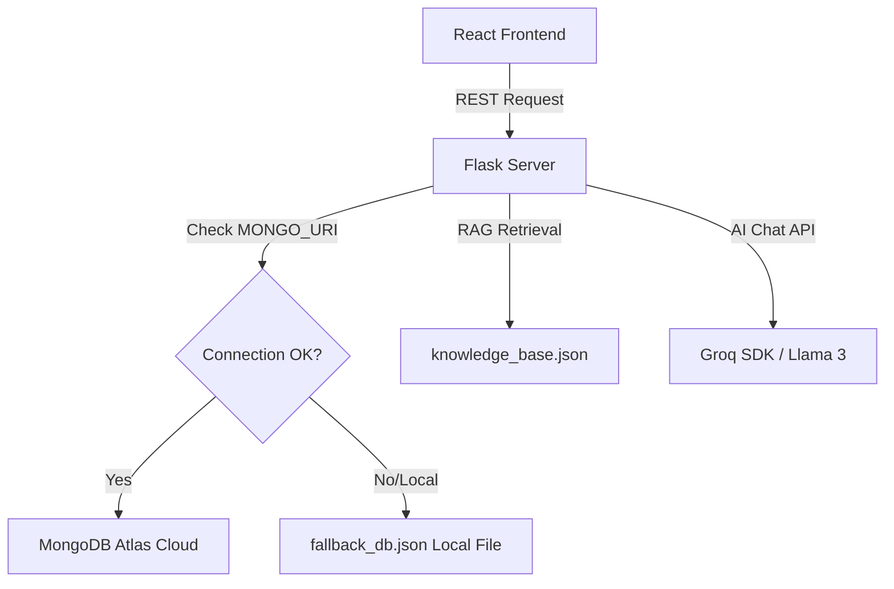

# 🌍 EcoChat: AI-Powered Climate Companion

EcoChat is a premium, full-stack web application designed to empower individuals to track their carbon footprint, adopt sustainable habits, participate in eco-challenges, and chat with an AI assistant grounded in verified climate science. The project addresses key UN Sustainable Development Goals: **SDG 13 (Climate Action)**, **SDG 7 (Affordable and Clean Energy)**, **SDG 12 (Responsible Consumption & Production)**, and **SDG 11 (Sustainable Cities & Communities)**.

---

## 🚀 Key Features

### 1. 🤖 AI Climate Assistant
* Grounded chat experience powered by a local vector retrieval mechanism referencing a verified green energy/climate science knowledge base.
* Integrated with **Groq SDK (Llama 3)** for natural, intelligent, and highly contextual replies.
* ChatGPT/Claude-style side panel to manage and name multiple concurrent chat sessions.
* **Privacy Isolation:** Fully resets chat history state and clears local storage tokens on user logout to prevent session cross-contamination.

### 2. 📊 Carbon Footprint Calculator
* Interactive form tracking electricity consumption, transport habits (vehicle fuel/type, flights), diet choices, waste generation, and water usage.
* **Dynamic Next Steps:** Personalized recommendations are generated in real-time based on the user's specific answers (e.g., suggesting meat-free days, composting, or carpooling where relevant).
* **VS. Benchmarks Gauges:** Visually compares the user's carbon footprint against local (India average: 1.9 tonnes) and Global (average: 4.7 tonnes) targets.
* **Tab-Close Reset:** Calculator state uses `sessionStorage`, automatically reverting to default clean forms when a tab is completely closed.

### 3. 🌱 Green Habit Tracker
* Interactive cards to log daily activities (walking, using a reusable bottle, unplugging idle electronics, etc.).
* Syncs and saves user streaks and statistics to the database.
* Built-in deserialization handlers to map icons dynamically to serialized database states without crashing.

### 4. 🏆 Climate Challenges & Eco Tips
* Gamified green challenges (e.g., *Plastic-Free Week*, *Composting Trial*) that users can join to build local community impact.
* Integrated "Save Tip" bookmarking across a curated catalog of actionable energy, waste, and food tips.

### 5. 🗺️ Sustainable Resource Locator
* Geolocation search interface to locate nearby EV charging stations, recycling hubs, compost centers, and solar installation agencies.

---

## 🛠️ Technology Stack

| Layer | Technologies Used | Description |
|---|---|---|
| **Frontend** | React, Vanilla CSS, Lucide React, Canvas Confetti | Rich glassmorphic UI, smooth micro-animations, and client-side routing. |
| **Backend** | Python, Flask, Flask-CORS, Gunicorn, RapidFuzz | REST API server with JWT-like session structures and fuzzy search vector retrieval. |
| **Database** | MongoDB Atlas (Cloud), File Fallback JSON | High-availability cloud database with an automatic local file storage fallback. |
| **AI Layer** | Groq Llama 3 (SDK), Custom Retrieval System | Intelligent semantic reasoning with references from verified knowledge bases. |

---

## 📁 Repository Structure

```text
EcoChat/
├── backend/
│   ├── app.py                  # Flask application server (endpoints, Auth, Sync, DB connectivity)
│   ├── prompts.py              # System prompts & retrieval contexts for the AI assistant
│   ├── retrieval.py            # Local vector search with rapidfuzz ranking
│   ├── knowledge_base.json     # Verified climate science facts & resource articles
│   ├── requirements.txt        # Python package dependencies (Flask, Groq, PyMongo, etc.)
│   └── .env                    # Cloud credentials (ignored in git)
├── frontend/
│   ├── public/
│   │   ├── _redirects          # Client-side router configuration for Netlify redirect rules
│   │   ├── logo.png            # Branded EcoChat logo (Earth, Robot, Solar)
│   │   └── index.html
│   ├── src/
│   │   ├── App.js              # Core React components, layout panels, and app states
│   │   ├── App.css             # Vanilla CSS tokens, animations, and typography configurations
│   │   └── index.js
│   └── package.json            # React app build scripts & dependencies
└── .gitignore                  # Global repository rules to ignore node_modules, secrets, and caches
```

---

## 🔒 Security & Database Integration



### Password Hashing
To secure credentials, all user passwords are encrypted using a cryptographic **SHA-256 hash** before storage. Plain text passwords are never stored in the database.

### MongoDB Safety Fallback
If the server's cloud connection is dropped or `MONGO_URI` is not supplied, the backend silently falls back to a local JSON file storage structure (`fallback_db.json`). This ensures the app is completely crash-proof.

---

## 🌐 API Reference

### 🔐 Authentication

#### 1. User Signup
* **Endpoint:** `POST /auth/signup`
* **Request Body:**
  ```json
  {
    "name": "Jane Doe",
    "email": "jane@example.com",
    "password": "securepassword"
  }
  ```
* **Success Response (201):**
  ```json
  {
    "success": true,
    "user": {
      "name": "Jane Doe",
      "email": "jane@example.com",
      "saved_tips": [],
      "bookmarked_articles": [],
      "joined_challenges": [],
      "saved_resources": [],
      "habits": []
    }
  }
  ```

#### 2. User Login
* **Endpoint:** `POST /auth/login`
* **Request Body:**
  ```json
  {
    "email": "jane@example.com",
    "password": "securepassword"
  }
  ```
* **Success Response (200):** returns the full user document.

---

### 🔄 Data Synchronization

#### User Progress Sync
* **Endpoint:** `POST /auth/sync`
* **Description:** Persists user statistics (completions, daily habits, bookmarks) to their profile in real-time.
* **Request Body:**
  ```json
  {
    "email": "jane@example.com",
    "saved_tips": [1, 3],
    "bookmarked_articles": [2],
    "joined_challenges": [5],
    "saved_resources": [],
    "habits": [...]
  }
  ```

---

### 💬 Chat Assistant

#### Retrieve Grounded Answer
* **Endpoint:** `POST /chat`
* **Request Body:**
  ```json
  {
    "question": "What are the benefits of solar panels?"
  }
  ```
* **Response:** Returns an AI text output grounded in standard facts, referencing sources if a database match was found.

---

## 💻 Local Setup & Development

### 1. Prerequisites
* Python 3.10+
* Node.js 18+

### 2. Configure Backend
1. Navigate to the `backend/` directory:
   ```bash
   cd backend
   ```
2. Install Python packages:
   ```bash
   pip install -r requirements.txt
   ```
3. Create a `.env` file inside `backend/` and add your keys:
   ```text
   GROQ_API_KEY=your_groq_key_here
   MONGO_URI="mongodb+srv://..." # Optional, defaults to fallback_db.json if omitted
   ```
4. Run the development server:
   ```bash
   python app.py
   ```
   *(Running locally on `http://127.0.0.1:5000`)*

### 3. Configure Frontend
1. Navigate to the `frontend/` directory:
   ```bash
   cd ../frontend
   ```
2. Install npm dependencies:
   ```bash
   npm install
   ```
3. Start the React development server:
   ```bash
   npm start
   ```
   *(Running locally on `http://localhost:3000`)*

---

## ☁️ Deployment

### Backend (Render)
1. Link your GitHub repository to [Render.com](https://render.com).
2. Create a new **Web Service**:
   * **Root Directory:** `backend`
   * **Runtime:** `Python`
   * **Build Command:** `pip install -r requirements.txt`
   * **Start Command:** `gunicorn app:app`
   * **Instance Type:** `Free ($0/month)`
3. Add environment variables under Settings:
   * `MONGO_URI` = `your_mongodb_connection_string`
   * `GROQ_API_KEY` = `your_groq_api_key`

### Frontend (Netlify)
1. Link your GitHub repository to [Netlify.com](https://www.netlify.com).
2. Import the project:
   * **Base Directory:** `frontend`
   * **Build Command:** `CI=false npm run build`
   * **Publish Directory:** `frontend/build`
3. Add environment variables:
   * `REACT_APP_API_URL` = `https://your-render-backend-url.onrender.com`
